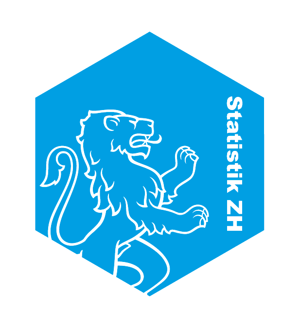

```{r setup, include=FALSE}
options(htmltools.dir.version = FALSE)
```


class: inverse, left, middle

# Corporate Design

.large[
- xlsx export functions

- color palettes

- ggplot2 theme

- RMarkdown pdf templates
]


---


class: inverse, center, bottom


# theme_stat()

## <br>a theme for ggplot2 graphics

<br>
.right[
]


---

class:top left

# Graphics with <font color=#009ee0>theme_stat()</font>

```{r, eval = T, echo = F, include = F}
library(ggplot2)
library(statRmd)
library(dplyr)
library(formatR)
library(gridExtra)
source("L:/STAT/03_AS/01_Werkzeuge/01_Toolbox/R/Funktionen/theme_stat_tex.r")
source("L:/STAT/03_AS/01_Werkzeuge/01_Toolbox/R/Funktionen/theme_stat.r")
```


.pull-left[
```{r, eval = F, echo = T, fig.height=5, fig.width=7, fig.align='center'}

ggplot(mtcars, 
       aes(x = factor(cyl), 
           fill = factor(cyl)))+
geom_bar(width = 0.7)


```
<br>
```{r, eval = T, echo = F, fig.height=4.55, fig.width=5, fig.align='center'}

ggplot(mtcars, 
       aes(x = factor(cyl),
           fill = factor(cyl)))+
geom_bar(width = 0.7)

```

]

--

.pull-right[
```{r, eval = F, echo = T, tidy=T, tidy.opts=list(blank=FALSE, width.cutoff=30)}

ggplot(mtcars, 
       aes(x = factor(cyl),
           fill = factor(cyl)))+
geom_bar()+
*theme_stat()

```

```{r, eval = T, echo = F, fig.height=4.5, fig.width=5, fig.align='center'}

ggplot(mtcars, aes(x = factor(cyl), 
                   fill = factor(cyl)))+
geom_bar(width = 0.7)+
theme_stat_tex()+
scale_fill_manual(values = zhpal$zhdiagonal, name = NULL)+
labs(y = NULL, x = NULL)

```
]


---

class: inverse, center, middle

# package statRmd

## <br>RMarkdown pdf templates

---

class: left, top


# Our Analytical Publications

- Periodic Reports -> highly automated
- Analytical studies -> custom made

.center[
.pull-left[


]

.pull-right[.left[
<br>
- PDF publications (mainly online)

- Blogs

- Short reports

- Periodic reports]
]]


---


class: top, left

# Starting Point: Why?

### Current state
- Analysis in various .r files
- Produce graphics with R and save as .png
- Include .png in Word
- Publish Word as PDF

--

### Goal
Establish an analysis and publication workflow, that
- is based on RMarkdown, and therefore is
  - traceable
  - «reproducible»
- allows publication of high quality charts and maps
- isin accordance to our corporate design


---


class: left, top

# Tools: How?

### «Standing on the shoulders of giants»

.center[

]


???
set up a RMarkdown file in RStudio render it with some tex-compiler through kniter and get the pdf. How can you custommize your pdf output? -> YAML header
---

class: left, top

# YAML Header

### That's where you define your output
```{r, eval = F, echo = T}
---
title: "Publication Title"
author: "Name Last Name"
*output:
*  pdf_document:
    latex_engine: xelatex
    dev: cairo_pdf
documentclass: article
fontsize: 12pt
classoption: a4paper
geometry: left=3.5cm, right=1.65cm, top=1.8cm, bottom=1.8cm
---
```


???
That is where the music plays. In the yaml header you define your output type, pdf, html, word, whatever, make all the necessary adjusmtents here. 

---

class: left, top

# Customize Output

### within YAML: header-includes
```{r, eval = F, echo = T}
---
header-includes:
  \usepackage{xcolor}
  \definecolor{zhblue}{RGB}{0,158,224}
  \usepackage{fontspec}
  \setmainfont[BoldFont = {Arial Black}]{Arial}
---
```

### my_template.tex
```{r, eval = F, echo = T}
---
pdf_document:
template: my_template.tex
---
```


???
Probably you may want do make adjustments to the default .tex layout. like font, colors, title page etc. 2 ways of doing this: 
- in the header-includes: you can do the tex-adjustments, loading packages, define colors etc.
- you create you own my_template.tex and overwrite rmarkdowns default .tex file 


---

class: left, top


# Build <font color=#009ee0>statRmd</font>  package

###  Why build a package?


- Code organization

- Consistent documentation

- Code distribution

<!-- - it has become pretty easy to do, thanks to    -->

<!-- .center[ -->
<!-- ] -->

- Enables template functionality

### Content

- RMarkdown Templates

- Some helper functions


---

class: left, top


# Load Template from <font color=#009ee0>statRmd</font>


File > New File > R Markdown > From Template


---

# Drawbacks

- Proofreading: how?
- PDF only: No word file available for comments
- 
---


# Resources


- RMarkdown from RStudio  
[Document Templates](http://rmarkdown.rstudio.com/developer_document_templates)

- Tutorial from Chester Ismay  
[Creating a basic template package in R](http://ismayc.github.io/ecots2k16/template_pkg/) 

- RStudio Blog  
[RMarkdown Custom Formats](https://blog.rstudio.com/2016/03/21/r-markdown-custom-formats/)

- [Google is your friend](http://lmgtfy.com/)


---
background-image: url("libs/sticker-01.png")
background-position: bottom right
background-size:30%

# Keep in touch

This presentation  
[RMeetup: Mastering Corporate Desing with R](https://schnllr.github.io/Meetup/)  

https://gist.github.com/statistik_zh

[https://statistik.zh.ch](https://statistik.zh.ch/internet/justiz_inneres/statistik/de/aktuell/mitteilungen/2017/jobs2017.html)

<a href="https://twitter.com/statistik_zh?ref_src=twsrc%5Etfw" class="twitter-follow-button" data-show-count="false">@statistik_zh</a><script async src="https://platform.twitter.com/widgets.js" charset="utf-8"></script>


<!-- .right[] -->
